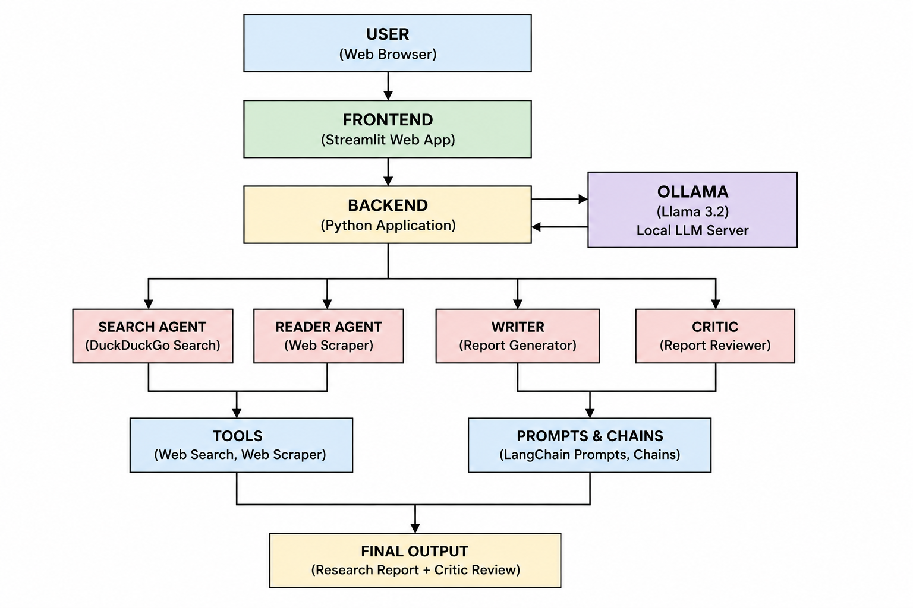

# 🧠 SYNAPSE — Multi-Agent AI Research System

A multi-agent AI research system that automates the entire research workflow. Four specialized AI agents collaborate in sequence — **searching** the web, **extracting** content, **writing** a structured report, and **reviewing** it for quality — all running locally via [Ollama](https://ollama.com).


---

## ✨ Features

- **4 Specialized Agents** — each handles one step of the research pipeline
- **100% Local** — runs on your machine using Ollama (no API keys needed)
- **Beautiful Web UI** — glassmorphism design with light/dark mode
- **Real-Time Progress** — Server-Sent Events stream each agent's status live
- **Markdown Reports** — download the final report as `.md`
- **Quality Scoring** — the Critic agent rates the report and gives feedback

---

## 🏗️ Architecture



| Agent | Role | Tool |
|-------|------|------|
| **Search Agent** | Searches the web for relevant sources | DuckDuckGo (via `ddgs`) |
| **Reader Agent** | Scrapes and extracts content from top URLs | BeautifulSoup |
| **Writer** | Generates a structured research report | LLM Chain |
| **Critic** | Reviews the report and provides a score | LLM Chain |


---

## 📁 Project Structure

```
Multi Agent AI Research System/
├── app.py              # Flask web server (SSE streaming)
├── pipeline.py         # Research pipeline (CLI + streaming generator)
├── agents.py           # Agent & chain definitions (LLM, prompts)
├── tools.py            # LangChain tools (web_search, scrape_url)
├── requirements.txt    # Python dependencies
└── templates/
    └── index.html      # Web UI (HTML/CSS/JS)
```

---

## 🚀 Getting Started

### Prerequisites

- **Python 3.10+**
- **Ollama** installed and running — [Download Ollama](https://ollama.com/download)

### 1. Clone the repository

```bash
git clone https://github.com/yourusername/multi-agent-ai-research-system.git
cd multi-agent-ai-research-system
```

### 2. Create a virtual environment

```bash
python -m venv .venv
```

Activate it:

- **Windows:** `.venv\Scripts\activate`
- **macOS/Linux:** `source .venv/bin/activate`

### 3. Install dependencies

```bash
pip install -r requirements.txt
```

### 4. Pull the LLM model

```bash
ollama pull llama3.2
```

> You can use any Ollama model. To change it, edit the `model` parameter in `agents.py`.

### 5. Run the app

```bash
python app.py
```

Open **http://localhost:5000** in your browser.

---

## 🖥️ Usage

1. Enter a research topic in the input field (e.g., *"Recent breakthroughs in solid-state batteries"*)
2. Click **Start Research**
3. Watch the 4 agents execute in real time:
   - 🔍 **Search Agent** — finds relevant web sources
   - 📄 **Reader Agent** — extracts content from the best URL
   - ✍️ **Writer** — drafts a structured report with Introduction, Key Findings, Conclusion, and Sources
   - ⭐ **Critic** — scores the report (X/10) with strengths and areas to improve
4. View the final report rendered as formatted Markdown
5. Click **↓ Download Markdown** to save the report

---

## ⚙️ Configuration

### Change the LLM model

In [`agents.py`](agents.py), modify the `ChatOllama` initialization:

```python
llm = ChatOllama(
    model="llama3.2",      # Change to any Ollama model
    temperature=0,
    num_ctx=8192
)
```

Popular options: `mistral`, `llama3.2`, `gemma2`, `qwen2.5`

### Change the Flask port

In [`app.py`](app.py), modify the last line:

```python
app.run(debug=True, port=5000, threaded=True)
```

---

## 💎 Paid Alternatives (Optional)

By default, SYNAPSE runs **100% free and locally**. However, you can swap in paid APIs for faster and more accurate results.

### Use OpenAI instead of Ollama

1. Install the OpenAI LangChain package:

   ```bash
   pip install langchain-openai
   ```

2. Create a `.env` file in the project root:

   ```
   OPENAI_API_KEY=sk-your-key-here
   ```

3. In [`agents.py`](agents.py), replace the LLM initialization:

   ```python
   # Before (local)
   from langchain_ollama import ChatOllama
   llm = ChatOllama(model="llama3.2", temperature=0, num_ctx=8192)

   # After (OpenAI)
   from langchain_openai import ChatOpenAI
   llm = ChatOpenAI(model="gpt-4o-mini", temperature=0)
   ```

   Supported models: `gpt-4o`, `gpt-4o-mini`, `gpt-3.5-turbo`

### Use Tavily instead of DuckDuckGo

[Tavily](https://tavily.com) provides an AI-optimized search API designed for LLM agents. It returns cleaner, more relevant results.

1. Install the Tavily package:

   ```bash
   pip install tavily-python langchain-community
   ```

2. Add your API key to `.env`:

   ```
   TAVILY_API_KEY=tvly-your-key-here
   ```

3. In [`tools.py`](tools.py), replace the search tool:

   ```python
   # Before (free)
   from ddgs import DDGS

   @tool
   def web_search(query: str) -> str:
       results = DDGS().text(query, max_results=5)
       ...

   # After (Tavily)
   from langchain_community.tools.tavily_search import TavilySearchResults

   web_search = TavilySearchResults(max_results=5)
   ```

### Comparison

| Feature | Free (Default) | Paid |
|---------|---------------|------|
| **LLM** | Ollama (local, unlimited) | OpenAI (fast, high quality) |
| **Search** | DuckDuckGo (free, no key) | Tavily (cleaner, AI-optimized) |
| **Privacy** | 100% on-device | Data sent to APIs |
| **Speed** | Depends on hardware | Very fast |
| **Cost** | $0 | ~$0.01–$0.10 per query |

> **Note:** You can mix and match — e.g., use OpenAI for the LLM but keep DuckDuckGo for search, or vice versa.

---

## 🛠️ Tech Stack

| Component | Technology |
|-----------|-----------|
| **LLM** | Ollama (local) |
| **Agent Framework** | LangChain |
| **Web Search** | DuckDuckGo (`ddgs`) |
| **Web Scraping** | BeautifulSoup + Requests |
| **Backend** | Flask |
| **Frontend** | Vanilla HTML/CSS/JS |
| **Streaming** | Server-Sent Events (SSE) |

---

## 📝 License

This project is open source and available under the [MIT License](LICENSE).

---

<p align="center">
  Built with ❤️ using LangChain, Ollama & Flask
</p>
